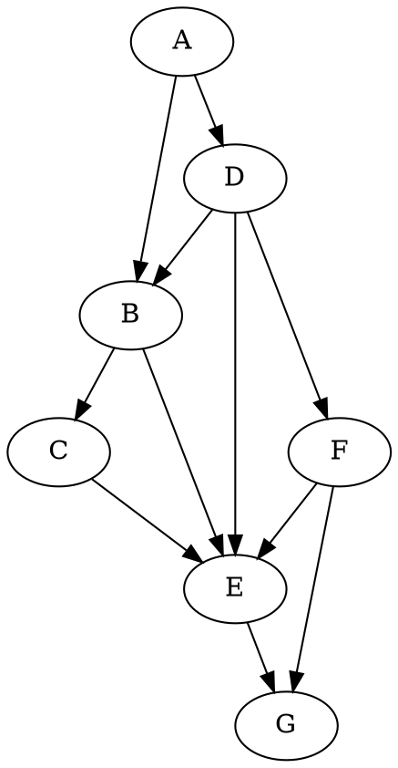

# architecture

The architecture is fundamentally based on petgraph.

`pgraph` uses two `generational arenas` to store the edges and nodes.

The graph is generic over the `node` and `edge` value. The graph doesn't store the values directly but wraps each in a structure called `Node` and `Edge` which contain additional metadata.

## Edge
`Node` storage is pretty self-explanatory.
`Edges` are trickier.

`Edge` is defined as follows
```rust
struct Edge<N, E> {
    weight: E,
    /// next edge in outgoing and incoming edge lists
    next: Next<N, E>,
    from: NodeIndex<N, E>
    to: NodeIndex<N, E>,
}
```

The lists are the trickiest part. Each edge is
```rust
fn add_edge(
    &mut self,
    a: NodeIndex<N, E>,
    b: NodeIndex<N, E>,
    weight: E) {
    let an = &self[a];
    let bn = &self[b];

    let edge = Edge {
        next: Next {
            outgoing: an.next.outgoing,
            incoming: bn.next.incoming,
        }
    }
    let edge_idx = self.edges.insert(edge);
    an.next.outgoing = Some(edge_idx);
    bn.next.incoming = Some(edge_idx);
}
```

Each edge is on two lists, the `outgoing` list of the `source` node and the `incoming` list of the `target`. 


